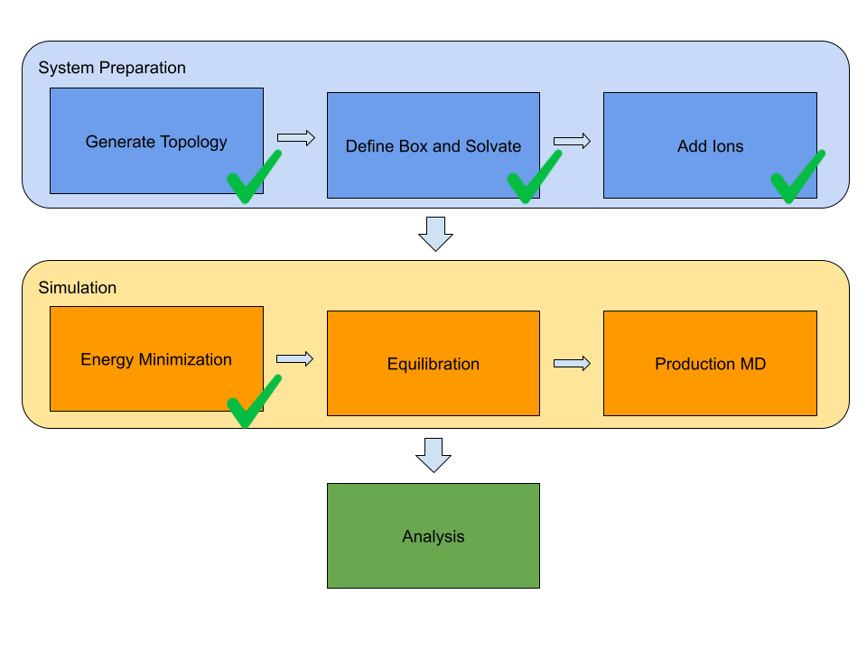

# gromacs_smolagent
An HF's Smolagent to automate molecular dynamics simulations using GROMACS.  
  

#### What is Gromacs?
[Gromacs](https://www.gromacs.org) is a popular, free and open-source software suite for high-performance molecular dynamics and output analysis.  
#### What is molecular dynamics?
Molecular dynamics (MD) is a computer simulation technique used to study the physical movements of atoms and molecules over time. It simulates the dynamics of a system by integrating Newton's laws of motion to track the trajectory of each atom, revealing how the system evolves. MD simulations are widely used to study the dynamics of biomolecules like proteins, in Drug Discovery to understand how drugs interact with their target molecules, in Material Science to study the properties of materials at the atomic level, including their structure, dynamics, and behavior under various condition, and to model chemical reactions.  
#### What is Smolagents?
[Smolagents](https://github.com/huggingface/smolagents) is a barebones library (around 1000 lines of code) from Hugging Face for agents that think in Python code. It is model-agnostic, tool-agnostic, and fully integrated with anything you can find in the Hugging Face's Hub.  
#### What is Hugging Face?
Seriuosly? If you are among the few dozens people in the world that have never heard of Hugging Face 🤗, please go discover that ecosystem [here](https://huggingface.co) before moving on with this repo.  
#### What's in this repo?
This repo provides a concrete example implementation of an AI agent that uses a lightweight library and an Open Source Small Language Model. The final implementation of this agent would automate setup, simulation and analysis tasks performed through the Gromacs tool.   
## Custom Tools
To date, the following tools for the Agent have been implemented:      
* *is_gromacs_installed*: to verify that a local Gromacs instance is available and running.
* *convert_pdb_to_gromacs*: to convert a .pdb file into .gro format.
* *create_index_file*: to create an index file for a given PDB file.
* *prepare_system_files*: to create the mandatory files for a Gromacs simulation (atom coordinates, topology and MD parameters) starting from a given PDB file.  
* *prepare_and_solvate_box*: to prepare a simulation box and solvate it.  
* *add_ions*: to add ions to the simulation box.  
## Warning
This is still a work in progress and doesn't cover yet all the phases of MD simulations (see the roadmap image below): expect multiple changes to the code in the incoming weeks. Any constructive feedback is welcome.  

## Usage
This project supports only Linux and MacOS. It isn't tested on Windows nor WSL (Windows Subsystem for Linux).  
#### Prerequisites
The software in the list below is mandatory before installing and using this Agent:
* Gromacs. Please follow the installation instructions for Linux or MacOS in the official documentation. The Agent has been tested on the Gromacs 2025.1 release.
* Python 3.12 or later.   
#### Installation
Just clone this repo locally:  
```
git clone https://github.com/virtualramblas/gromacs_smolagent.git  
cd gromacs_smolagents
```  
#### Virtual environment setup.
The Python requirements for this Agent are listed in the [requirements.txt](./requirements.txt) file. Whatever package manager you feel more confortable with, please ensure that all the requirements have been installed before the first execution of the code. To date, this tool has been built on the following:  
* Smolagents
* PyTorch
* Transformers
* Accelerate
#### Small Language Model (SLM) used
The models that the Agent can use are:  
* [Qwen 2.5 3B Instruct](https://huggingface.co/Qwen/Qwen2.5-3B-Instruct), in FP 16 format.  
* [Qwen 2.5 1.5B Instruct](https://huggingface.co/Qwen/Qwen2.5-1.5B-Instruct), in FP 16 format.  
  
To date, these are those providing the best performance. The evaluation process of other models is still ongoing. The Qwen 2.5 models above require hardware acceleration (NVIDA GPU or Apple Silicon) with minimum 8 GB VRAM. 16 GB VRAM preferable for the 3B version, to have a smoother experience. The model checkpoints are automatically downloaded from the HF's Hub at the first tool execution. They are then cached in the local machine (no need to be connected to the web for any further run, when sticking to the same model).
#### CLI Execution
The tool can be executed from the CLI. The ```gromacs_agent.py``` script is the enrty point for execution. In its minimal form it can be executed as follows:  
```
python gromacs_agent.py -pdb_file <path_to_the_pdb_file>
```
The ```-h``` option prints to the standard output the help related to the full set of options for the script:  
```
python gromacs_agent.py -h                                                              
usage: gromacs_agent.py [-h] -pdb_file PDB_FILE [-force_field FORCE_FIELD]
                        [-water_model {none,spc,spce,tip3p,tip4p,tip5p,tips3p}]
                        [-box_size BOX_SIZE] [-concentration CONCENTRATION]
                        [-workspace WORKSPACE]
                        [-task {pulse_check,conversion_to_gro,prepare_files,generate_box,add_ions}]
                        [-model {Qwen/Qwen2.5-3B-Instruct,Qwen/Qwen2.5-1.5B-Instruct}]

An AI Agent that handles Gromacs workflows.

options:
  -h, --help            show this help message and exit
  -pdb_file PDB_FILE    The path and name of the starting PDB file.
  -force_field FORCE_FIELD
                        The force field to use when preparing the simulation
                        files.
  -water_model {none,spc,spce,tip3p,tip4p,tip5p,tips3p}
                        The water model to use.
  -box_size BOX_SIZE    The size of the simulation box.
  -concentration CONCENTRATION
                        The total salt concentration expressed in mol/L
  -workspace WORKSPACE  The directory where to store all the files for a
                        simulation.
  -task {pulse_check,conversion_to_gro,prepare_files,generate_box,add_ions}
                        The task for the agent.
  -model {Qwen/Qwen2.5-3B-Instruct,Qwen/Qwen2.5-1.5B-Instruct}
                        The Small Language Model to be used by the agent.
```
#### UI
Coming soon.  

