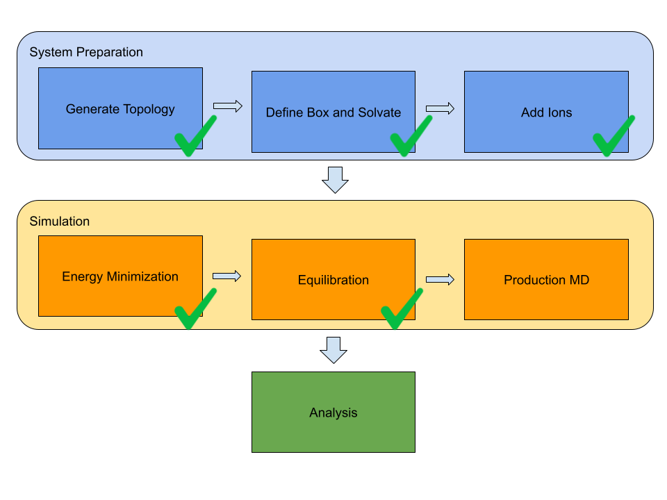

# gromacs_smolagent
An HF's Smolagent to automate molecular dynamics simulations using GROMACS.  
  

  
Next presentation for this project would be at the [Festival of Genomics and Biodata 2026](https://festivalofgenomics.com/london/) in London, UK, on January 28th 2026.  
  
This project has been presented at the [BioTechX Europe 2025](https://www.terrapinn.com/conference/biotechx/index.stm) conference in Basel, Switzerland, on October 7th 2025.    
  
## 🤝 Contributing
Please open an issue for new requirements, provide feedback, spread the word and leave a star if you like it.  
# Table of contents
[What is Gromacs?](README.md#what-is-gromacs)  
[What is molecular dynamics?](README.md#what-is-molecular-dynamics)  
[What is Smolagents?](README.md#what-is-smolagents)  
[What is Hugging Face?](README.md#what-is-hugging-face)  
[What's in this repo?](README.md#whats-in-this-repo)  
[Custom Tools](README.md#custom-tools)  
[Warning](README.md#warning)  
[Usage](README.md#usage)  
&nbsp;&nbsp;&nbsp;&nbsp;[Prerequisites](README.md#prerequisites)  
&nbsp;&nbsp;&nbsp;&nbsp;[Installation](README.md#installation)  
&nbsp;&nbsp;&nbsp;&nbsp;[Virtual environment setup](README.md#virtual-environment-setup)  
&nbsp;&nbsp;&nbsp;&nbsp;[Small Language Model (SLM) used](README.md#small-language-model-slm-used)  
&nbsp;&nbsp;&nbsp;&nbsp;&nbsp;&nbsp;&nbsp;&nbsp;[Local Models through the HF's Transformers API](README.md#local-models-through-the-hfs-transformers-api)  
&nbsp;&nbsp;&nbsp;&nbsp;&nbsp;&nbsp;&nbsp;&nbsp;[Local Models through Ollama](README.md#local-models-through-ollama)  
&nbsp;&nbsp;&nbsp;&nbsp;[CLI Execution](README.md#cli-execution)  
&nbsp;&nbsp;&nbsp;&nbsp;[Agent Inspectability](README.md#agent-inspectability)  
[UI](README.md#ui)  
#### What is Gromacs?
[Gromacs](https://www.gromacs.org) is a popular, free and open-source software suite for high-performance molecular dynamics and output analysis.  
#### What is molecular dynamics?
Molecular dynamics (MD) is a computer simulation technique used to study the physical movements of atoms and molecules over time. It simulates the dynamics of a system by integrating Newton's laws of motion to track the trajectory of each atom, revealing how the system evolves. MD simulations are widely used to study the dynamics of biomolecules like proteins, in Drug Discovery to understand how drugs interact with their target molecules, in Material Science to study the properties of materials at the atomic level, including their structure, dynamics, and behavior under various condition, and to model chemical reactions.  
#### What is Smolagents?
[Smolagents](https://github.com/huggingface/smolagents) is a barebones library (around 1000 lines of code) from Hugging Face for agents that think in Python code. It is model-agnostic, tool-agnostic, and fully integrated with anything you can find in the Hugging Face's Hub.  
#### What is Hugging Face?
Seriuosly? If you are among the few dozens people in the world that have never heard of Hugging Face 🤗, please go discover that ecosystem [here](https://huggingface.co) before moving on with this repo.  
#### What's in this repo?
This repo includes the source code of a concrete example implementation of Agentic AI built on top of a lightweight library and an Open Source Small Language Model. The final implementation would automate setup, simulation and analysis tasks performed through the Gromacs tool.   
## Custom Tools
To date, the following tools for the Agents have been implemented:      
* *is_gromacs_installed*: to verify that a local Gromacs instance is available and running.
* *convert_pdb_to_gromacs*: to convert a .pdb file into .gro format.
* *create_index_file*: to create an index file for a given PDB file.
* *prepare_system_files*: to create the mandatory files for a Gromacs simulation (atom coordinates, topology and MD parameters) starting from a given PDB file.  
* *prepare_and_solvate_box*: to prepare a simulation box and solvate it.  
* *add_ions*: to add ions to the simulation box.  
* *gromacs_energy_minimization*: to setup and run energy minimization.  
* *plot_edr_to_png*: to plot an energy file (energy minimization or equilibration) and save the chart in PNG format.  
* *gromacs_equilibration*: to setup and run equilibration.  
* *download_from_protein_data_bank*: to download structures from the [Protein Data Bank](https://www.rcsb.org).  
* *is_pdb_valid*: to verify if a given PDB file has a valide structure.  
* *remove_water_molecules*: to remove water molecules from a PDB structure.  
  
You can see some examples of this Agentic AI solution in action in the [gallery](docs/Gallery.md).
## Warning
This is still a work in progress and doesn't cover yet all the phases of MD simulations (see the roadmap image below): expect multiple changes to the code in the incoming weeks. Any constructive feedback is welcome.  

The first version of this solution was based on a single agent (which is going to be deprecated soon). The current one is multi-agent based.  
## Usage
This project supports only Linux and MacOS. It isn't tested on Windows nor WSL (Windows Subsystem for Linux).  
#### Prerequisites
The prerequisites in the list below are mandatory before installing and using this Agent:
* Gromacs. Please follow the installation instructions for Linux or MacOS in the official documentation. The Agent has been tested on the Gromacs 2025.1 release.
* Python 3.12 or later.   
* GPU (NVIDIA or Apple Silicon) or [Ollama](https://ollama.com).  
#### Installation
Just clone this repo locally:  
```
git clone https://github.com/virtualramblas/gromacs_smolagent.git  
cd gromacs_smolagents
```  
Then install the requirements listed in the following section.  
#### Virtual environment setup
The Python requirements for this Agent are listed in the [requirements.txt](./requirements.txt) file. Whatever package manager you feel more confortable with, please ensure that all the requirements have been installed before the first execution of the code. To date, this tool has been built on the following:  
* Smolagents
* PyTorch
* Transformers
* Accelerate  
* Matplotlib  
* Biopython
* OpenTelemetry (for agent inspectability only)  
#### Small Language Model (SLM) used
##### Local Models through the HF's Transformers API
The models that the Agent can use are:  
* [Qwen 2.5 3B Instruct](https://huggingface.co/Qwen/Qwen2.5-3B-Instruct), in FP 16 format.  
* [Qwen 2.5 1.5B Instruct](https://huggingface.co/Qwen/Qwen2.5-1.5B-Instruct), in FP 16 format.  
  
To date, these are those providing the best performance. The evaluation process of other models is still ongoing. The Qwen 2.5 models above require hardware acceleration (NVIDA GPU or Apple Silicon) with minimum 8 GB VRAM. 16 GB VRAM preferable for the 3B version, to have a smoother experience. The model checkpoints are automatically downloaded from the HF's Hub at the first tool execution. They are then cached in the local machine (no need to be connected to the web for any further run, when sticking to the same model).  
##### Local Models through Ollama
This option is suitable for local machines where no GPU is available or the local GPU has no more than 8 GB VRAM.  
The models that the Agent can use are:
* [Ollama's Qwen 2.5 3B Instruct](https://ollama.com/library/qwen2.5:3b).   

To date, this is the one providing the best performance. The evaluation process of other models is ongoing.  
Before the first run, the model's checkpoints need to be installed to the Ollama server:  
```
ollama pull qwen2.5:3b
```
#### CLI Execution
The tool can be executed from the CLI. The ```gromacs_multi_agent.py``` script is the entry point for execution. In its minimal form it can be executed as follows:  
```
python gromacs_multi_agent.py -pdb_file <path_to_the_pdb_file>
```
The ```-h``` option prints to the standard output the help related to the full set of options for the script:  
```
python gromacs_multi_agent.py -h                                                              
usage: gromacs_multi_agent.py [-h] [-pdb_file PDB_FILE] [-force_field FORCE_FIELD]
                              [-water_model {none,spc,spce,tip3p,tip4p,tip5p,tips3p}] [-box_size BOX_SIZE]
                              [-concentration CONCENTRATION] [-workspace WORKSPACE]
                              [-task {pdb_validation,pdb_download,pdb_analysis,remove_water,pulse_check,conversion_to_gro,prepare_files,generate_box,add_ions,energy_minimization,plot_energy}]
                              [-provider {transformers,ollama}] [-ollama_api_base OLLAMA_API_BASE]
                              [-model {Qwen/Qwen2.5-3B-Instruct,Qwen/Qwen2.5-1.5B-Instruct,qwen2.5:3b}]
                              [-telemetry TELEMETRY] [-telemetry_server_url TELEMETRY_SERVER_URL]
                              [-structure_id STRUCTURE_ID]

An AI Multi-Agent that handles Gromacs workflows.

options:
  -h, --help            show this help message and exit
  -pdb_file PDB_FILE    The path and name of the starting PDB file.
  -force_field FORCE_FIELD
                        The force field to use when preparing the simulation files.
  -water_model {none,spc,spce,tip3p,tip4p,tip5p,tips3p}
                        The water model to use.
  -box_size BOX_SIZE    The size of the simulation box.
  -concentration CONCENTRATION
                        The total salt concentration expressed in mol/L
  -workspace WORKSPACE  The directory where to store all the files for a simulation.
  -task {pdb_validation,pdb_download,pdb_analysis,remove_water,pulse_check,conversion_to_gro,prepare_files,generate_box,add_ions,energy_minimization,plot_energy}
                        The task for the agent.
  -provider {transformers,ollama}
                        The provider type to use for inference.
  -ollama_api_base OLLAMA_API_BASE
                        The Ollama API base URL.
  -model {Qwen/Qwen2.5-3B-Instruct,Qwen/Qwen2.5-1.5B-Instruct,qwen2.5:3b}
                        The Small Language Model to be used by the agent.
  -telemetry TELEMETRY  Enables telemetry when set to True. Default is False.
  -telemetry_server_url TELEMETRY_SERVER_URL
                        The telemetry server URL. This argument is used only when telemetry is enabled
  -structure_id STRUCTURE_ID
                        The id of the structure to download from the Protein Data Bank.

```  
To execute the old version of the tool (single agent based), you need to run the ```gromacs_agent.py``` script. Its syntax is exactly the same as for the multi-agent version.  
#### Agent Inspectability
To inspect agent runs, this project uses [OpenTelemetry](https://opentelemetry.io), the standard instrumentation chosen by Hugging Face. The telemetry backend is Arize AI's [Phoenix](https://github.com/Arize-ai/phoenix). A Phoenix server instance can be started locally by running the following command within the project's Python virtual environment:  
```
python -m phoenix.server.main serve
```   
Telemetry in gromacs_smolagent is disabled by default. When starting the application, you need to set the ```telemetry``` argument to ```True``` to enable it. The ```telemetry_server_url``` argument can then be used to specify the telemetry server URL. As soon as the agent is running, you can inspect it by opening the telemetry server UI in a web browser (the default listening port is 6006, unless you have specified a different one):  

#### UI
To be decided how to make it really user-friendly.  

